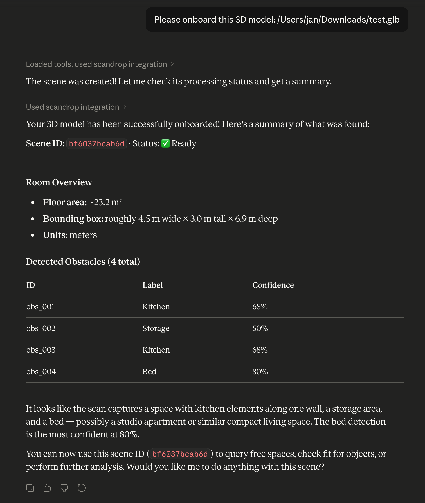
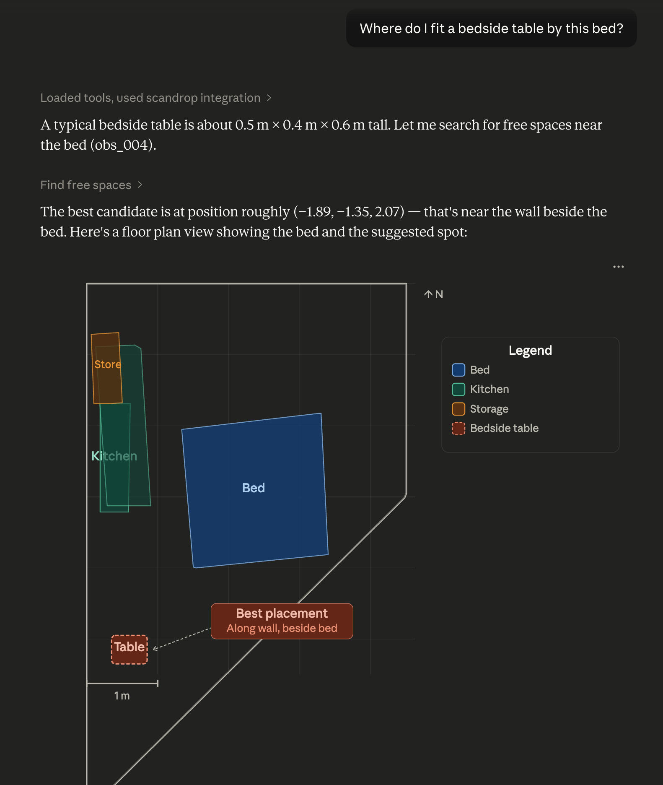
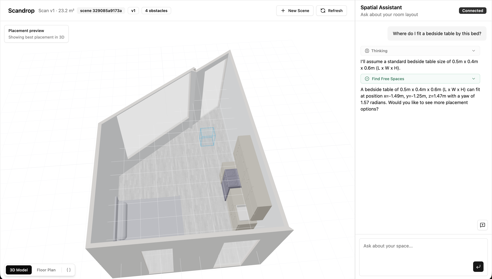

# scandrop

Minimal but real MCP server that ingests a GLB/GLTF floorplan scan (for example captured with Polycam https://poly.cam/) and exposes deterministic spatial tools over a compact derived scene graph.

<p>
  
  
</p>

## Install

```bash
uv sync --python 3.12
```

## Claude Desktop setup

Use `scandrop` in combination with the `filesystem` MCP so Claude can both run spatial tools and read your local `.glb/.gltf` files.

After `uv sync`, configure Claude Desktop (`claude_desktop_config.json`) with both servers:

```json
{
  "mcpServers": {
    "filesystem": {
      "command": "npx",
      "args": ["-y", "@modelcontextprotocol/server-filesystem", "/Users/<username>/Downloads", "/Users/<username>/Desktop"]
    },
    "scandrop": {
      "command": "uv",
      "args": ["run", "--project", "/absolute/path/to/scandrop-mcp", "python", "-m", "scandrop.main"]
    }
  }
}
```

Restart Claude Desktop after saving the config.

## What scandrop MCP does

- Loads `.glb` / `.gltf` mesh exports (including Polycam free-plan outputs).
- Derives a compact spatial database:
  - dominant floor plane
  - floor polygon in XZ
  - obstacle footprints + OBBs + heuristic semantic labels
  - scene AABB bounds
- Persists versioned scene artifacts on local disk:
  - `./data/scenes/{scene_id}/v{version}/scene_graph.json`
  - `./data/scenes/{scene_id}/v{version}/params.json`
- Exposes deterministic MCP tools (`check_fit`, `find_free_spaces`) so the model never does geometry math.
- Provides optional FastAPI debug endpoints.

## Quickstart

### 1) Ingest a scan

```bash
python scripts/ingest.py path/to/scan.glb
```

Example output:

```json
{
  "scene_id": "ab12cd34ef56",
  "version": 1
}
```

### 2) Run MCP server (stdio)

```bash
python -m scandrop.main
```

### 2b) Configure MCP clients (e.g., Claude Desktop)

After `uv sync`, most MCP clients can launch this server via `uv run` from the project directory. In Claude Desktop, keep this server enabled together with `filesystem`.

Claude Desktop config (`claude_desktop_config.json`):

```json
{
  "mcpServers": {
    "scandrop": {
      "command": "uv",
      "args": ["run", "--project", "/absolute/path/to/scandrop-mcp", "python", "-m", "scandrop.main"]
    }
  }
}
```

Generic MCP client config shape:

```json
{
  "servers": {
    "scandrop": {
      "command": "uv",
      "args": ["run", "--project", "/absolute/path/to/scandrop", "python", "-m", "scandrop.main"]
    }
  }
}
```

### 2c) Load a scene (recommended user flow)

In Claude Desktop, users only need to provide a path to the 3D model:

```text
Please onboard this 3D model: /Users/<username>/Downloads/test.glb
```

Scandrop handles scene creation, status, and summary internally via `onboard_scene`.

### 3) Run FastAPI debug server (optional)

```bash
python scripts/run_api.py --reload
```

## Claude Desktop tutorial (attach + ingest a GLB)

Use this flow when you have both connectors enabled:

- `filesystem` connector (to read files from your machine)
- `scandrop` MCP server (this repo)
- A GLB/GLTF scan export (for example from [Polycam](https://poly.cam/))

1. Place your `.glb` file in a folder exposed by filesystem, for example `/Users/<username>/Downloads/test.glb`.
2. Send this prompt:

```text
Please onboard this 3D model: /Users/<username>/Downloads/test.glb
```

3. The assistant runs onboarding in one step and returns:
- `scene_id` and `version`
- processing status (usually `ready`)
- scene summary (bounds, floor area, obstacle count)

4. Ask a placement question, for example:

```text
Where do I fit a bedside table by the bed?
```

For the full web app tutorial and UI screenshot, see [web/README.md](web/README.md).

## MCP tools

### `create_scene_from_gltf`

Input:

```json
{ "path": "/absolute/path/to/scan.glb" }
```

Output:

```json
{ "scene_id": "ab12cd34ef56", "version": 1 }
```

### `onboard_scene`

Input:

```json
{ "path": "/absolute/path/to/scan.glb" }
```

Output:

```json
{
  "scene_id": "ab12cd34ef56",
  "version": 1,
  "status": { "status": "ready", "message": null },
  "summary": {
    "bounds_aabb": { "min": [0.0, -0.1, -2.0], "max": [5.2, 2.8, 4.4] },
    "floor_area_m2": 17.42,
    "obstacle_count": 6
  }
}
```

### `get_processing_status`

Input:

```json
{ "scene_id": "ab12cd34ef56" }
```

Output:

```json
{ "status": "ready", "message": null }
```

### `get_scene_summary`

Input:

```json
{ "scene_id": "ab12cd34ef56", "version": 1 }
```

Output:

```json
{
  "bounds_aabb": { "min": [0.0, -0.1, -2.0], "max": [5.2, 2.8, 4.4] },
  "floor_area_m2": 17.42,
  "obstacle_count": 6
}
```

### `get_scene_graph`

Input:

```json
{ "scene_id": "ab12cd34ef56", "version": 1 }
```

Output:

```json
{
  "units": "meters",
  "room": { "floor_plane": { "normal": [0, 1, 0], "d": -0.02 }, "floor_polygon_xz": [[0, 0], [5, 0], [5, 4], [0, 4]], "bounds_aabb": { "min": [0, -0.1, 0], "max": [5, 2.7, 4] } },
  "obstacles": [{ "id": "obs_001", "footprint_xz": [[1, 1], [1.8, 1], [1.8, 1.7], [1, 1.7]], "obb": { "center": [1.4, 0.5, 1.35], "extent": [0.8, 1.0, 0.7], "rotation": [[1, 0, 0], [0, 1, 0], [0, 0, 1]] } }]
}
```

### `check_fit`

Input:

```json
{
  "scene_id": "ab12cd34ef56",
  "size_m": [2.0, 0.9, 0.8],
  "pose": { "pos": [1.2, 0.4, -0.8], "yaw_rad": 1.57 },
  "clearance_m": 0.3
}
```

Output:

```json
{
  "ok": false,
  "reasons": ["collides_obstacle:obs_002"]
}
```

### `find_free_spaces`

Input:

```json
{
  "scene_id": "ab12cd34ef56",
  "size_m": [2.0, 0.9, 0.8],
  "clearance_m": 0.5,
  "yaw_steps": 4,
  "grid_step_m": 0.2,
  "max_results": 3
}
```

Output:

```json
{
  "candidates": [
    {
      "pos": [4.0, 0.4, 1.2],
      "yaw_rad": 1.57,
      "score": 1.246,
      "notes": ["wall_distance_m=0.184", "center_distance_m=1.430"]
    }
  ]
}
```

### `list_scenes`

Input:

```json
{}
```

Output:

```json
[
  {
    "scene_id": "ab12cd34ef56",
    "created_at": "2026-02-18T20:00:00Z",
    "latest_version": 1
  }
]
```

## FastAPI debug endpoints

- `POST /scenes/import`
  - multipart upload with `file` field, or JSON body `{ "path": "/abs/path.glb" }`
- `GET /scenes/{scene_id}/summary`
- `GET /scenes/{scene_id}/scene_graph`
- `GET /health`

## Data model snapshot

`scene_graph.json`:

```json
{
  "units": "meters",
  "room": {
    "floor_plane": { "normal": [0.0, 1.0, 0.0], "d": -0.02 },
    "floor_polygon_xz": [[0.0, 0.0], [5.0, 0.0], [5.0, 4.0], [0.0, 4.0]],
    "bounds_aabb": { "min": [0.0, -0.1, 0.0], "max": [5.0, 2.7, 4.0] }
  },
  "obstacles": [
    {
      "id": "obs_001",
      "footprint_xz": [[1.0, 1.0], [1.8, 1.0], [1.8, 1.7], [1.0, 1.7]],
      "obb": {
        "center": [1.4, 0.5, 1.35],
        "extent": [0.8, 1.0, 0.7],
        "rotation": [[1.0, 0.0, 0.0], [0.0, 1.0, 0.0], [0.0, 0.0, 1.0]]
      }
    }
  ]
}
```

## Notes

- Determinism: fixed random seed for mesh surface sampling, deterministic sorting for obstacle IDs and candidate ranking.
- Semantic labels are heuristic and currently include broad classes such as `bed`, `kitchen`, `table`, `storage`, and `unknown`.

## Web App Workbench

A UI app is included at `./web` with:

- source model viewer (GLB/GLTF)
- derived spatial representation viewer (floor + obstacles)
- MCP-backed chat panel with prompt chips



Run it:

```bash
cd web
npm install
npm run dev
```

Then open `http://localhost:3000`.
